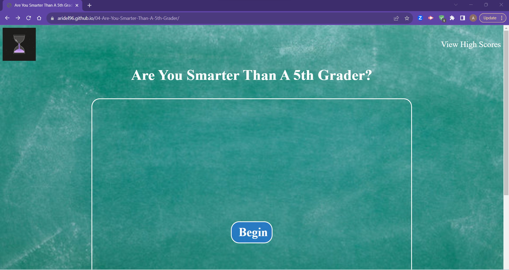

# 04-Are-You-Smarter-Than-A-5th-Grader

## Description
Challenge 04 from the University of Minnesota FullStack Flex Coding Bootcamp

This project focuses on using Web API's to build a timed quiz. Through this project I learned about Web API's and Client-Side Storage, as well as more about events. I learned about the Document Object Model and interactivity. Through these topics I've also learned about events and how to handle those events using methods such as addEventListener.

## Code Source
* CSS .choices:hover and .button:hover - https://stackoverflow.com/questions/6422790/css-create-white-glow-around-image

## Screenshot and Link
https://aridel96.github.io/04-Are-You-Smarter-Than-A-5th-Grader/

## License
MIT

